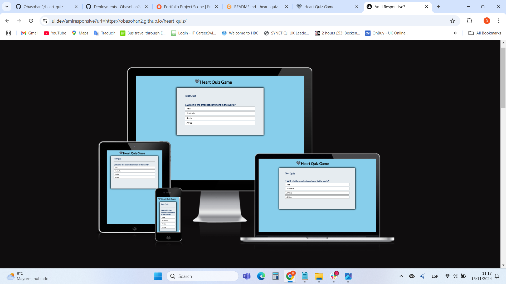
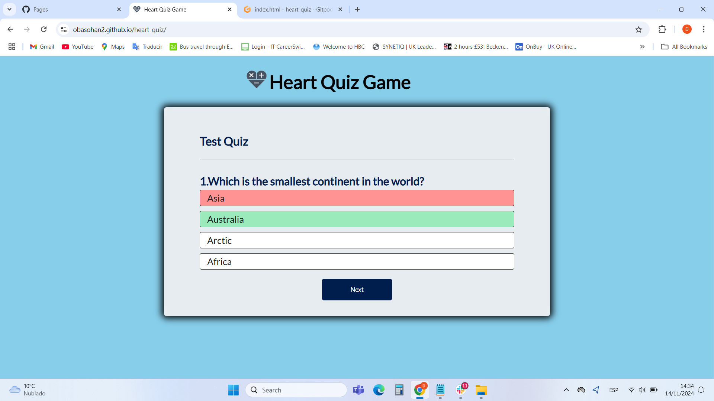
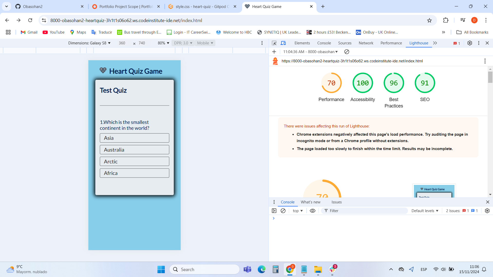

# Heart Quiz Game

![Heart Quiz Game image shown on a variety of screen sizes] 

Visit the deployed site: <a href="https://obasohan2.github.io/heart-quiz/">Heart Quiz Game</a>

Heart Quiz Game is a kind of educative quiz game center on current affairs hereby testing general knowledge with the heart quiz game. 

## CONTENTS

<h2>Design</h2>

<h3>Colour Scheme</h3>

In my css file I have used variables to declare colours, and then used these throughout the css file. I was recently introduced to this method during a code institute study and had some help from slack chat room - it is a useful convention to use as it allows you to alter the colour throughout the website if you decide to update a colour, by changing the colour once in the variable.

I have used  #E6ECF0 as the button background.
 

 I have use #2222 for the hover background
 

I have used  #fff as the text colour
. 

I have used #001e4d;; for the next button background
 

I have used rgb(127, 212, 164) to display the correct answer .

I have used #ee7272; to display the wrong answer .

 i have use this #001e4d; for the game area h2 

<h3>Features</h3>

The website is comprised of a home page, game page and score page. All Pages on the website are responsive and have: A favicon icon and title in the browser tab.

<li><a href="https://github.com">Github</a> - To save and store the files for the website.</li>
<li><a href="https://gitpod.io/">GitPod</a> - IDE used to create the site.</li>
<li><a href="https://fonts.google.com/">favicon.io</a>Google Fonts - To import the fonts used on the website.</li>
<li><a href="https://developer.chrome.com/docs/">Google Developer Tools</a> - To troubleshoot and test features, solve issues with responsiveness and styling.</li>
<li><a href="https://favicon.io/">favicon.io</a> To create favicon.</li>
<li><a href="https://ui.dev/amiresponsive">Am I Responsive?</a> To show the website image on a range of devices.
<li><a href="https://fonts.google.com/">Google Fonts</a> - To import the fonts used on the website.</li>
<li><a href="https://developer.chrome.com/docs/"> - Google Developer Tools</a> - To troubleshoot and test features, solve issues with responsiveness and styling.</li>
<li><a href="https://favicon.io/">favicon.io</a> - To create favicon.</li>
<li><a href="https://ui.dev/amiresponsive">Am I Responsive?</a> - To show the website image on a range of devices.
</ul>

<h2>Manual Testing and Code Validation</h2>
<ul>
<li>I used  <a href="https://jshint.com/">JSHint JavaScript Validator</a> to validate all the Javascript codes which resulted: "Document checking completed. No errors or warnings to show"</li>

<li>I used  <a href="https://jigsaw.w3.org/css-validator">HTML Validator w3c</a> to validate all the HTML codes which resulted: "Document checking completed. No errors or warnings to show"</li>
<li>I used  <a href="https://validator.w3.org">CSS Validator jigsaw</a> to validate the CSS codes to validate the CSS style codes and resulted: "Congratulations! No Error Found"</li>
<li>I used the google chrome "Lighthouse" Developer Tools to test and analise with score results as follows: Performance: 72%, Accessibility: 98%, Best Practices: 96%, SEO:100%</li>

</ul>

<h3>Deployment & Local Development</h3>

Deployment

The site is deployed using GitHub Pages - <a href="https://obasohan2.github.io/heart-quiz/">Heart Quiz Game</a>. 

<h3>To Deploy the site using GitHub Pages:</h3>
<ol>
<li>Login (or signup) to Github.</li>
<li>Go to the repository for this project, https://github.com/Obasohan2/heart-quiz.</li>
<li>Click the settings button.</li>
<li>Select pages in the left hand navigation menu.</li>
<li>From the source dropdown select main branch and press save.</li>

The site has now been deployed, please note that this process may take a few minutes before the site goes live.

</ol>

<h2>Local Development</h2>
<h3>How to Fork</h3>

To fork the repository
:

<ol>
<li>Log in (or sign up) to Github.
<li>Go to the repository for this project, <a href="https://obasohan2.github.io/heart-quiz/">Heart Quiz Game</a>.</li>
<li>Click the Fork button in the top right corner.</li>
</ol>

<h3>How to Clone</h3>

To clone the repository:

<ol>
<li>Log in (or sign up) to GitHub.</li>
<li>Go to the repository for this project, <a href="https://obasohan2.github.io/heart-quiz/">Heart Quiz Game</a>.</li>
<li>Click on the code button, select whether you would like to clone with HTTPS, SSH or GitHub CLI and copy the link shown.</li>
<li>Open the terminal in your code editor and change the current working directory to the location you want to use for the cloned directory.</li>
<li>Type 'git clone' into the terminal and then paste the link you copied in step 3. Press enter.</li>
</ol>

<h2>Credits</h2> 

Code Used

I used various youtube tutorials <a href="https://www.youtube.com/@GreatStackDev">GreatStack</a>  to find more options as to solution when i am stocked 

I  researched on <a href="https://www.w3schools.com">W3SCHOOLS</a> to learn more on website responsive and semantics and applied the knowledge

I  researched on this <a href="https://developer.mozilla.org">MDN</a> to learn more on html and CSS semantics 

I knowledged code aquired from <a href="www.codeinstitute.net"> Code Institute</a> to for my webpage.

<h3>Content</h3>

All gallery photos for my site were pulled from google image.

All other content for the site, such as introduction messages and instructions were written by myself.

<h3>Acknowledgments</h3>

I would like to acknowledge the following people:

<strong>Jubril Akolade</strong> - My Code Institute Mentor.

<strong>Ioan Zaharia</strong> - who was giving listening ear and encouragements when i was face with some difficulties.

The Code Institute Slack channel Peer Code Review - Thank you to everyone who took the time to loo through the responsive webpage and look over the code.
